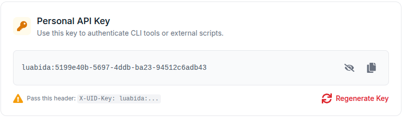
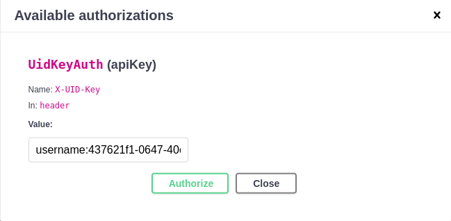

# Chave da API

As requisições da API Mosqlimate exigem uma Chave de API do Usuário. O Token será gerado após a autenticação no Github, na página de perfil do usuário: `https://mosqlimate.org/profile/auth`.

O token `X-UID-Key` deve ser incluído nos cabeçalhos de cada requisição. Exemplos de cabeçalhos autenticados podem ser encontrados na [Demonstração da API](https://api.mosqlimate.org/api/docs).

## Autorizando na Demonstração da API

Para testar os endpoints usando a [Demonstração da API](https://api.mosqlimate.org/api/docs), você deve incluir sua UID-Key no formulário `Authorize` (sem aspas):

